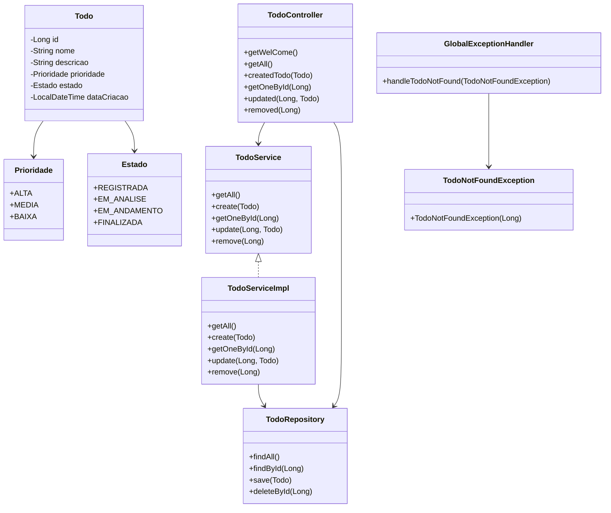

# ToDo List 2025
 Projeto ToDo List - Utilizando Spring Boot 3, Java 17 e Railway ( Servidor na Nuvem )

# Diagrama de Classe

```mermaid
classDiagram
    %% Modelos
    class Todo {
        -Long id
        -String nome
        -String descricao
        -Prioridade prioridade
        -Estado estado
        -LocalDateTime dataCriacao
    }

    class Prioridade {
    +ALTA
    +MEDIA
    +BAIXA
   }
    class Estado {
    +REGISTRADA
    +EM_ANALISE
    +EM_ANDAMENTO
    +FINALIZADA
  }

    %% Repositório
    class TodoRepository {
        +findAll()
        +findById(Long)
        +save(Todo)
        +deleteById(Long)
    }

    %% Serviço
    class TodoService {
        +getAll()
        +create(Todo)
        +getOneById(Long)
        +update(Long, Todo)
        +remove(Long)
    }

    class TodoServiceImpl {
        +getAll()
        +create(Todo)
        +getOneById(Long)
        +update(Long, Todo)
        +remove(Long)
    }

    %% Controller
    class TodoController {
        +getWelCome()
        +getAll()
        +createdTodo(Todo)
        +getOneById(Long)
        +updated(Long, Todo)
        +removed(Long)
    }

    %% Exceções
    class TodoNotFoundException {
        +TodoNotFoundException(Long)
    }

    class GlobalExceptionHandler {
        +handleTodoNotFound(TodoNotFoundException)
    }

    %% Relacionamentos
    Todo --> Prioridade
    Todo --> Estado
    TodoService <|.. TodoServiceImpl
    TodoController --> TodoService
    TodoController --> TodoRepository
    TodoServiceImpl --> TodoRepository
    GlobalExceptionHandler --> TodoNotFoundException


```
