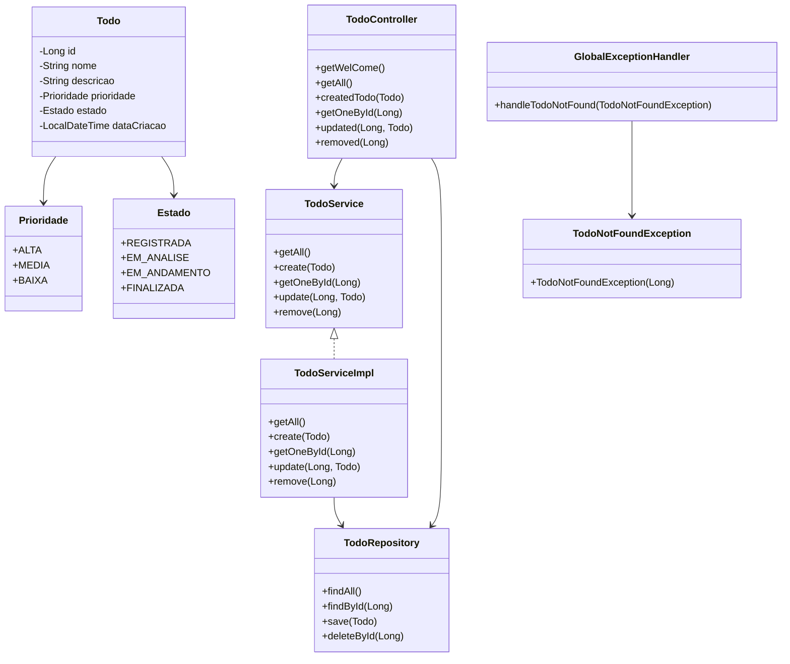

# To Do List 2025
Uma API RESTful para gerenciamento de tarefas (todos), construída com Java 17 e Spring Boot 3, e hospedada na nuvem via Railway. Este projeto segue boas práticas de arquitetura em camadas, tratamento de exceções, uso de enums e documentação automática com Swagger.

# Diagrama de Classe
Abaixo está o diagrama de classes que representa a estrutura principal da aplicação:

##  Tecnologias Utilizadas

* Java 17 – linguagem principal
* Spring Boot 3 – framework para construção da API
* Spring Web – para criação dos endpoints REST
* Spring Data JPA – para persistência de dados
* Swagger/OpenAPI – para documentação automática da API
* Railway – plataforma de deploy na nuvem

## Endpoints Principais
Método	Endpoint	Descrição
GET	/	Mensagem de boas-vindas
GET	/todos	Lista todas as tarefas
POST	/todos	Cria uma nova tarefa
GET	/todos/{id}	Busca uma tarefa por ID
PUT	/todos/{id}	Atualiza uma tarefa existente
DELETE	/todos/{id}	Remove uma tarefa

## Tratamento de Erros

O projeto possui tratamento global de exceções via GlobalExceptionHandler, com destaque para:

* TodoNotFoundException: lançada quando uma tarefa não é encontrada pelo ID informado.

## Deploy

O projeto está hospedado na Railway.

* [To Do List](https://todolist-production-10a3.up.railway.app/swagger-ui/index.html#/)